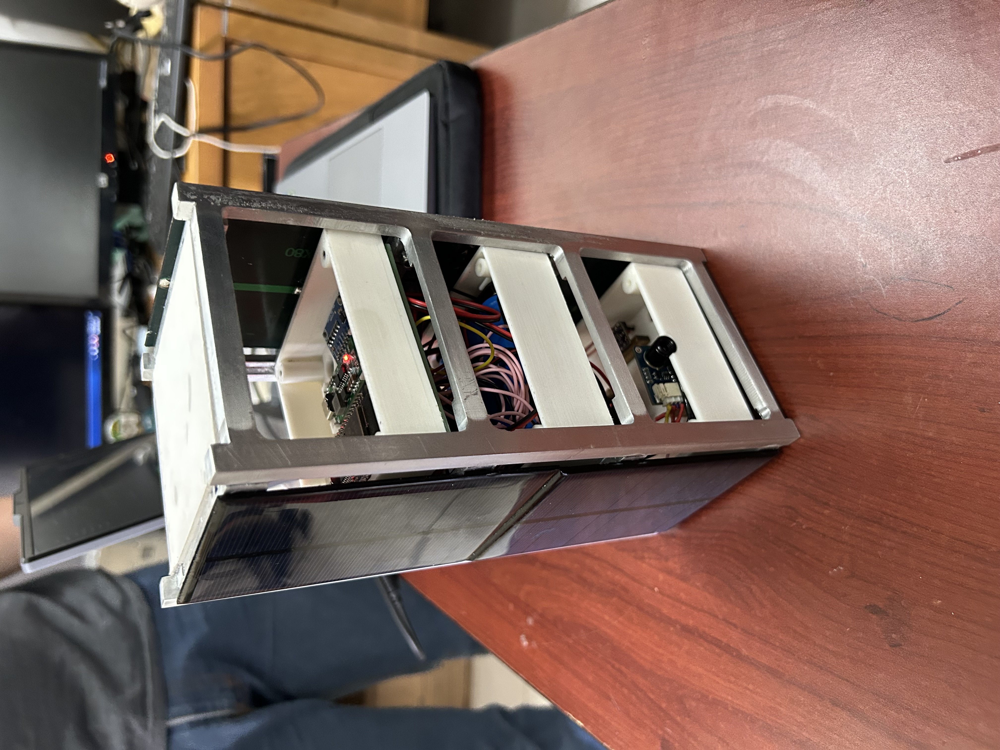

# Kauil-Sat · U2 CubeSat Project

> CubeSat developed for the CanSat 2026 worldwide competition organized by UNAM.  
> Built and tested at the National Autonomous University of Mexico.

---

## 🛰️ About the Project

Kauil-Sat is a U2-format CubeSat prototype designed and built by a student team at UNAM.  
The satellite integrates multiple subsystems including power, structure, communications, and onboard data acquisition.

This repository contains the code for two core systems:
- **Onboard firmware** — Arduino-based microcontroller handling sensor data acquisition and RF telemetry transmission
- **Ground station interface** — Python-based telemetry display for real-time data visualization and logging

---

## ⚙️ Subsystems

| Subsystem | Description |
|-----------|-------------|
| Electronics | Onboard circuit design, sensor integration, power management |
| Telecommunications | RF transceiver configuration, data packet formatting, ground link |
| Telemetry Interface | Python GUI for real-time data display and logging at ground station |

---

## 🛠️ Technologies Used

- **Arduino (C++)** — Onboard microcontroller firmware
- **Python** — Ground station telemetry interface
- **RF Communication** — Wireless data transmission between satellite and ground station

---

## 📡 System Architecture

- [CubeSat]
└── Sensors → Microcontroller → RF Transmitter
↓
[Ground Station]
└── RF Receiver → Python Interface → Real-time Display & Data Log

---

## 🖼️ Hardware

*Kauil-Sat prototype showing internal subsystem layout — electronics, telecommunications, and structural layers.*

---

## 👨‍🚀 Author

**José Pablo Morales Hernández**  
Earth & Space Sciences · UNAM  
[LinkedIn](https://linkedin.com/in/pablo-morales-4304b8324)
